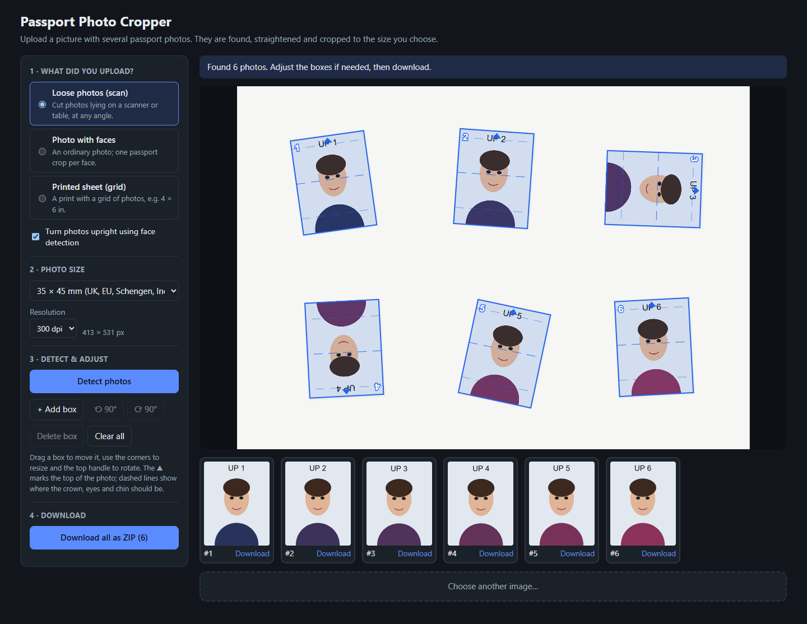
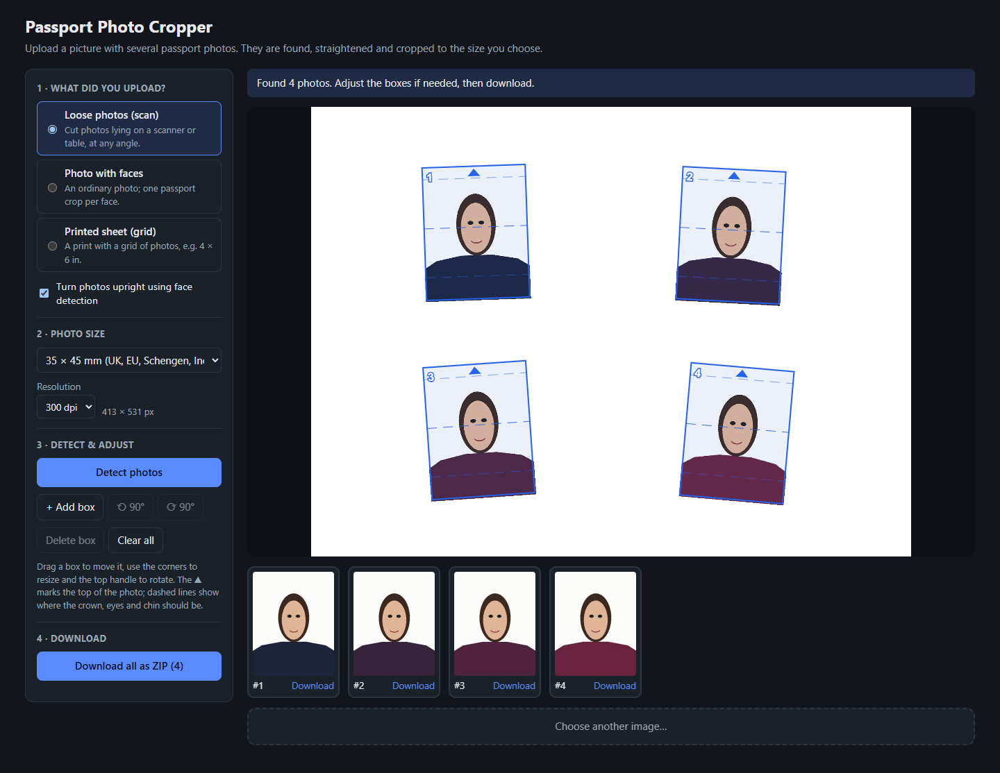
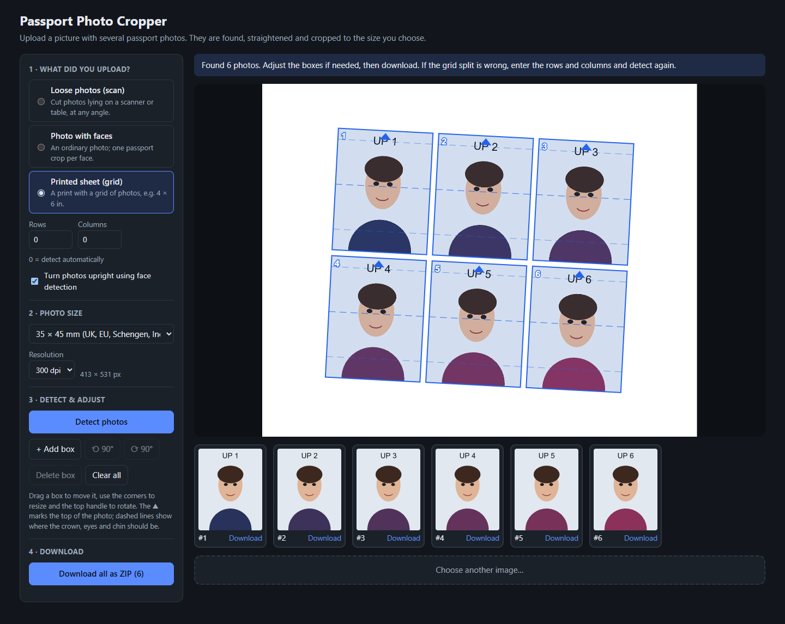

# Passport Photo Cropper

**[Try it online →](https://relatora.github.io/passport-cropper/)**

A free web app that takes one picture containing several passport photos, finds each
photo, straightens it, and exports each one cropped to the chosen passport size
(35×45 mm, 2×2 in, and others) as a print-ready JPEG, either one at a time or all
together in a ZIP.

Everything runs in the browser. The photos are never uploaded anywhere.



## Features

- **Scans of loose photos** at any angle, including sideways and upside-down ones, which are turned upright using face detection.
- **White-background photos on a white scanner**, where the paper edge is nearly invisible. The photo's rectangle is rebuilt from the person's silhouette.
- **Printed photo sheets** (for example, a 4 × 6 in print with a grid of passport photos) are split into single photos.
- **Ordinary photos of one or more people**: one passport crop per face.
- **Common sizes**: 35×45 mm (UK, EU, Schengen, India, Australia), 2×2 in (US), 33×48 mm (China visa), 35×35 mm, 50×70 mm (Canada), or custom.
- **Print-ready output** at 300 or 600 dpi, with the DPI written into the JPEG so it prints at the right size.
- **Private**: no server and no uploads. Images are processed on your device with OpenCV and MediaPipe compiled to WebAssembly.

| White-background photos on a white scanner | A printed sheet split into single photos |
| --- | --- |
|  |  |

The screenshots use the synthetic test images in [`samples/`](samples/).

## Running it

```bash
npm install
npm run dev        # http://localhost:5173
npm test           # unit + OpenCV integration tests
npm run build      # static site in dist/
```

`npm install` copies MediaPipe's WASM runtime into `public/mediapipe/`. The face-detection
model (~230 KB) is fetched from Google's MediaPipe model storage the first time faces are
used.

## Picture types

| Mode | Use it for | How it works |
| --- | --- | --- |
| **Loose photos (scan)** | Cut photos lying on a scanner or table at any angle | Builds a mask of pixels that differ from the border colour, plus Canny edges, then closes it. Each large rectangular contour becomes a photo, measured with `minAreaRect`. A white-background photo on a white scanner has no visible edge and shows up as a head-and-shoulders blob instead. Its rectangle is rebuilt from the silhouette: the side the shoulders fill end to end is the bottom edge (which also says which way is up), a line fit along it gives the tilt, the shoulders give the width, and the faint paper edge above the head gives the height (or, if it can't be seen, the size's aspect ratio). Blobs that don't fit that pattern fall back to a crop placed around the face. |
| **Photo with faces** | An ordinary photo of one or more people | MediaPipe BlazeFace runs on the whole image and on overlapping tiles, so small faces in group shots are found too. Rotation comes from the eye line, size from the eye-to-mouth distance, and position from the preset's head size and margin above the crown. |
| **Printed sheet (grid)** | A print with a grid of identical photos | The tilt comes from the rotated bounding box of all content. The mask is rotated upright, and empty columns and rows (gutters) split it into cells. With no gutters (edge-to-edge prints) it divides evenly by the rows and columns you enter. |

In scan and grid mode, an optional pass renders each crop upright and upside down
(and sideways, for square sizes) and keeps the orientation where the face detector is
most confident. This fixes photos that were placed on the scanner the wrong way round.

## Adjusting

Every detection can be corrected by hand. You can drag a box, resize it from a corner
(the aspect ratio stays locked to the chosen size), rotate it with the top handle (it
snaps at 90°), or turn it by 90° with the buttons. The ▲ marks the top of the photo.
Dashed lines show where the crown, eyes and chin should fall for the chosen size.

## Output

Each photo is rendered at the exact pixel size for the chosen DPI (35×45 mm at 300 dpi is
413×531 px). The JPEG's JFIF header is patched to carry that DPI, so it prints at the
right physical size.

## Code map

```
src/
  App.tsx                 state, upload → detect → edit → export flow
  geometry.ts             pure helpers: angle normalisation, aspect fitting, gutter splitting
  presets.ts              passport sizes and their head/eye proportions
  detect/
    index.ts              picks a detector, scales results, fits the preset aspect, orients
    cvDetect.ts           OpenCV scan and grid detection (pure; also runs in Node tests)
    cv.worker.ts          runs cvDetect in a Web Worker
    faces.ts              MediaPipe face detection, face framing, auto-orientation
  components/             Toolbar, CropEditor (react-konva), PreviewStrip, UploadDropzone
  export/                 crop rendering, JFIF DPI patching, ZIP
samples/                  synthetic test images and the script that generates them
```

## Deployment

Every push to `main` builds the site and publishes it to GitHub Pages
([`.github/workflows/deploy.yml`](.github/workflows/deploy.yml)). The build is served
from `/passport-cropper/`, which `vite.config.ts` sets as the base path.

Search engines get a full page even before the app loads. `index.html` contains:
- a descriptive title and meta description
- the canonical URL
- Open Graph and Twitter preview tags with [`public/og-image.png`](public/og-image.png)
- JSON-LD `WebApplication` data
- a plain-HTML introduction that the app replaces once it starts

`public/` also holds `robots.txt` and `sitemap.xml`. These follow the
[search-engine-optimization](https://github.com/marcobiedermann/search-engine-optimization)
checklist.

## Limitations

- Face framing is calibrated on real passport photos (head height ≈ 4.1 × MediaPipe's eye-to-mouth distance). Hair varies, so check the guide lines before printing.
- Faces mode does not find faces that are sideways or upside down.
- Grid sheets printed edge to edge with no gutters need the rows and columns entered,
  because a 2×2 sheet has the same outline as a single photo.
- This app crops and sizes photos. It does not check background colour, lighting or
  expression against any country's rules.
